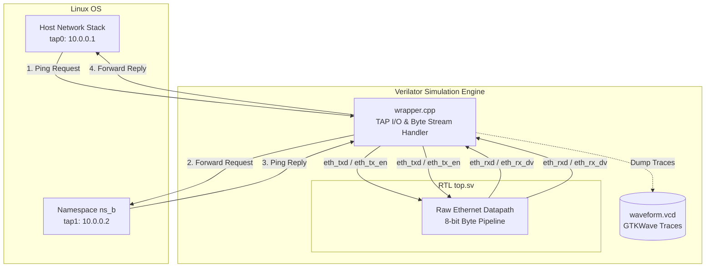

# Hardware-in-the-Loop Testbench Architecture (Lab 1: Raw Ethernet)

This testbench connects real Linux network stacks to a Verilated raw 8-bit Ethernet hardware datapath in real time.



---

## Port Mapping & Datapath Interfaces

| Signal Port | Direction | Interface Width | Description |
| :--- | :--- | :--- | :--- |
| `clk` | Input | 1-bit | Master Ethernet clock domain |
| `rst_n` | Input | 1-bit | Active-low synchronous reset |
| `eth_txd` | Input | 8-bit | Transmit raw byte bus driven by C++ wrapper |
| `eth_tx_en` | Input | 1-bit | Transmit enable control flag |
| `eth_rxd` | Output | 8-bit | Receive raw byte bus output from RTL datapath |
| `eth_rx_dv` | Output | 1-bit | Receive data valid flag |

---

## Datapath Processing Flow

1. **Software Framing (`wrapper.cpp`)**
   * Captures raw Layer-2 Ethernet frames from `tap0` or `tap1`.
   * Calculates and appends Ethernet CRC-32 Frame Check Sequence (FCS).
   * Formats the packet into an 8-bit byte stream preceded by standard 7-byte Preamble (`0x55`) and 1-byte SFD (`0xD5`).

2. **8-Bit Stream Management**
   * Asserts `eth_tx_en` high during active frame header and payload transmission.
   * Streams frame bytes sequentially on `eth_txd[7:0]` at one byte per clock cycle.

3. **RTL Datapath (`top.sv`)**
   * Buffers, validates, and forwards raw byte streams across the hardware pipeline.
   * Preserves inter-frame gap (IFG) boundaries between packet transmissions.

4. **Frame Reconstruction & Delivery**
   * Monitors `eth_rx_dv` and captures valid output bytes from `eth_rxd[7:0]`.
   * Reassembles full Layer-2 Ethernet frames, verifies FCS integrity, and forwards packets to the target TAP interface.

---

## Key Signals for Waveform Analysis (GTKWave)

Inspect `waveform.vcd` using GTKWave:
```bash
gtkwave waveform.vcd
```

Add these top-level signals to analyze raw 8-bit Ethernet datapath transfers:

* **`TOP.top.clk`**: Master clock driving byte-by-byte transfers.
* **`TOP.top.rst_n`**: Active-low reset state.
* **`TOP.top.eth_txd[7:0]`**: 8-bit incoming transmit data stream.
* **`TOP.top.eth_tx_en`**: Transmit enable indicator (`1'b1` during active packet streaming).
* **`TOP.top.eth_rxd[7:0]`**: 8-bit output receive data stream.
* **`TOP.top.eth_rx_dv`**: Receive data valid indicator.
