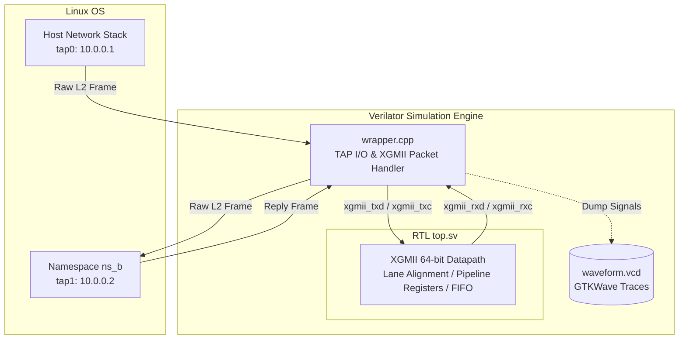

# Hardware-in-the-Loop Testbench Architecture (Lab 2: 64-bit XGMII)

This testbench connects real Linux network stacks to a Verilated IEEE 802.3 Clause 46 64-bit XGMII (10 Gigabit Media Independent Interface) hardware datapath in real time.



---

## Port Mapping & Datapath Interfaces

| Signal Port | Direction | Interface Width | Description |
| :--- | :--- | :--- | :--- |
| `clk` | Input | 1-bit | XGMII Transmit/Receive Clock domain (156.25 MHz equivalent) |
| `rst_n` | Input | 1-bit | Active-low synchronous reset |
| `xgmii_txd` | Input | 64-bit | Transmit Data bus (8 lanes $\times$ 8 bits) driven by C++ wrapper |
| `xgmii_txc` | Input | 8-bit | Transmit Control bus (1 control bit per data lane) |
| `xgmii_rxd` | Output | 64-bit | Receive Data bus output from RTL datapath |
| `xgmii_rxc` | Output | 8-bit | Receive Control bus output from RTL datapath |

---

## Datapath Processing Flow

1. **Software Framing (`wrapper.cpp`)**
   * Captures raw Layer-2 Ethernet frames from the host Linux TAP interface (`tap0`).
   * Appends Ethernet CRC-32 Frame Check Sequence (FCS).
   * Formats payload into standard 64-bit XGMII words with Start control characters (`/S/` = `0xFB`), Preamble (`0x55`), SFD (`0xD5`), and Terminate control characters (`/T/` = `0xFD`).

2. **XGMII Control Lane Mapping**
   * **Data Lanes (`txc = 0`):** Normal frame payload bytes are transmitted across 8 parallel 8-bit lanes.
   * **Control Lanes (`txc = 1`):** Idle characters (`0x07`), Start (`0xFB`), or Terminate (`0xFD`) control characters are flagged.

3. **RTL Processing (`top.sv`)**
   * Buffers, validates lane alignment, and pipes 64-bit XGMII words through the register stages.
   * Maintains inter-packet gap (IPG) alignment requirements across 8-byte boundaries.

4. **Frame Reconstruction & Injection**
   * Sampled output signals (`xgmii_rxd`, `xgmii_rxc`) are processed by `wrapper.cpp`.
   * Strips XGMII control characters, verifies FCS, and forwards valid packets to the destination TAP interface (`tap1`).

---

## Key Signals for Waveform Analysis (GTKWave)

Inspect `waveform.vcd` using GTKWave:
```bash
gtkwave waveform.vcd
```

Add these top-level signals to analyze 64-bit XGMII datapath transfers:

* **`TOP.top.clk`**: Master clock signal driving 64-bit transfers.
* **`TOP.top.rst_n`**: Reset state.
* **`TOP.top.xgmii_txd[63:0]`**: 64-bit Transmit Data bus (Lanes 0–7).
* **`TOP.top.xgmii_txc[7:0]`**: Transmit Control flags (`8'h00` for pure payload, `8'h01` for lane 0 Start/Control).
* **`TOP.top.xgmii_rxd[63:0]`**: 64-bit Receive Data bus output.
* **`TOP.top.xgmii_rxc[7:0]`**: Receive Control flags output.
