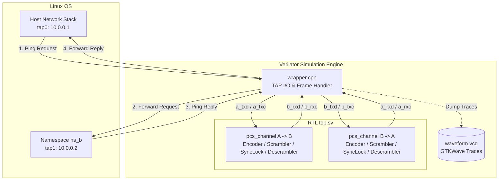

# Hardware-in-the-Loop Testbench Architecture (Lab 3: 64b/66b PCS)

This testbench connects real Linux network stacks to a Verilated IEEE 802.3ae Clause 49 64b/66b Physical Coding Sublayer (PCS) hardware implementation in real time.



---

## Port Mapping & Datapath Interfaces

| Direction | Linux Interface | C++ Wrapper Binding | SystemVerilog Top Port | Interface Width | Description |
| :--- | :--- | :--- | :--- | :--- | :--- |
| **Host $\rightarrow$ RTL** | `tap0` (Host) | `top->a_txd`, `top->a_txc` | `a_txd`, `a_txc` | 64-bit Data / 8-bit Control | XGMII Transmit stream from Host |
| **RTL $\rightarrow$ `ns_b`** | `tap1` (`ns_b`) | `top->b_rxd`, `top->b_rxc` | `b_rxd`, `b_rxc` | 64-bit Data / 8-bit Control | Reconstructed receive stream to Node B |
| **`ns_b` $\rightarrow$ RTL** | `tap1` (`ns_b`) | `top->b_txd`, `top->b_txc` | `b_txd`, `b_txc` | 64-bit Data / 8-bit Control | XGMII Transmit reply stream from Node B |
| **RTL $\rightarrow$ Host** | `tap0` (Host) | `top->a_rxd`, `top->a_rxc` | `a_rxd`, `a_rxc` | 64-bit Data / 8-bit Control | Reconstructed receive reply stream to Host |

---

## Datapath Processing Flow

1. **Software Framing (`wrapper.cpp`)**
   * Reads Layer-2 frames directly from `tap0` or `tap1`.
   * Calculates and appends a 4-byte Ethernet CRC-32 FCS.
   * Wraps the payload with standard 7-byte Preamble (`0x55`) and 1-byte SFD (`0xD5`).
   * Pads the total stream length to an exact multiple of 8 bytes to preserve pure Data Block sync headers (`2'b01`).

2. **RTL Transmit Path (`pcs_encoder` & `pcs_scrambler`)**
   * **Encoder:** Maps XGMII control flags (`txc`) to 2-bit Sync Headers (`2'b01` for Data, `2'b10` for Control).
   * **Scrambler:** Applies self-synchronizing LFSR scrambling $G(X) = 1 + X^{39} + X^{58}$ to payload bits while preserving sync headers.

3. **Receiver Alignment (`pcs_sync_lock`)**
   * Evaluates continuous 2-bit sync headers cycle-by-cycle.
   * Asserts `block_lock` high after 64 consecutive valid sync headers (`2'b01` or `2'b10`) are received.

4. **RTL Receive Path (`pcs_descrambler` & `pcs_decoder`)**
   * **Descrambler:** Recovers original unscrambled 64-bit payload using history registers.
   * **Decoder:** Converts 66-bit blocks back into standard XGMII receive lines (`rxd` / `rxc`) for C++ frame assembly.

---

## Key Signals for Waveform Analysis (GTKWave)

Inspect `waveform.vcd` using GTKWave:
```bash
gtkwave waveform.vcd
```

Add these top-level signals to analyze full-duplex PCS behavior:

* **`TOP.top.a_txd[63:0]`**: Raw outgoing packet data from Host (`tap0`).
* **`TOP.top.a2b_unscrambled_tx_block[65:0]`**: Encoded 66-bit block before scrambling (bits `[1:0]` show `2'b01` during data transfer).
* **`TOP.top.a2b_scrambled_tx_block[65:0]`**: Scrambled payload with intact 2-bit sync header.
* **`TOP.top.a2b_block_lock`**: High (`1'b1`) when lock state machine completes alignment.
* **`TOP.top.b_rxd[63:0]`**: Descrambled, decoded packet data delivered to `ns_b` (`tap1`).
